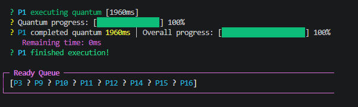

# 📝 MY_WORK: Student Information, Development Log, Reflection & Answers

> This is the **only file** your instructor reads to grade Parts 3 and 4 (documentation and video). Everything you write here must be **in your own words**.

---

## 🛑 STOP: Read This Before You Do Anything Else

> ### 1️⃣ Read the whole `README.md` first
> The `README.md` in this repository contains the full instructions: class descriptions, feature specifications, question prompts and the video script. **If you skip it, you will lose marks.**
>
> ### 2️⃣ Understand the full code before answering any question
> Open `SchedulerSimulation.java` and read it **from top to bottom**. You must be able to explain what `Process`, `run()`, `runToCompletion()`, `addProcessToQueue()`, `Thread.start()`, `Thread.join()` and `Thread.sleep()` do **before** you write a single answer in Parts B and C. Run the program at least once and watch the output.
>
> ### 3️⃣ Commit many times, not once
> A single commit, or all commits made in the last hour, costs you **-0.5 mark**. See the [Commit Rules](#-commit-rules-mandatory) below.

**How to use this file:**
1. Fill in your **Student Information** (below) right now.
2. Follow the steps in the **Work Roadmap** in order.
3. Update the **Development Log** *every time* you work on the assignment, not at the end.
4. Do not delete any section header. Replace the `[...]` placeholders with your own text.

---

## 👤 Student Information

> ⚠️ **WARNING:** Fill this in first. Your name and ID must match the student ID you set in `SchedulerSimulation.java` (line 150) and the one you say in your video.

| Field | Your Answer |
|-------|-------------|
| **Full Name** | Mardiyyah Nizaam Kariem |
| **Student ID** | 445052815 |
| **University Email** | 445052815@std.psau.edu.sa |
| **GitHub Username** | Mardiyyah-kar123 |
| **Repository Link** | https://github.com/Mardiyyah-kar123/OS-Assignment1-Mardiyyah-Kariem |
 
---

## 🎥 Video Link

**Video Link**: [https://drive.google.com/file/d/1_F460Hn6qxQPKouBdlrFQOV45oWHCz0G/view?usp=sharing] 

> ⚠️ **WARNING:** The video must be **publicly accessible** ("Anyone with the link can view") on **Google Drive**, **YouTube (Unlisted or Public)** or any other cloud file-sharing system. A private, restricted or broken link counts as a **missing video (-1 mark)**.
>
> 💡 **TIP:** Open the link in a **private/incognito window** before you submit. If it asks you to log in or request access, it is not public.
>
> 📌 **NOTE:** The link goes in **this file only** (`MY_WORK.md`), **not** in `README.md`. Name your video file `StudentID_Assignment1_Demo.mp4`. It must last **2 to 3 minutes**.

---

## 🗺️ Work Roadmap (follow in this order)

| Step | What to do | Where | Marks |
|:----:|------------|-------|:-----:|
| 0 | Read `README.md`, then read and run the full code | Your IDE | – |
| 1 | Fork, rename, keep the repo **PUBLIC**, set your student ID (line 150), **commit** | GitHub + code | Part 1 (1) |
| 2 | Feature 1: Process Priority, **commit** | Code | Part 2 (0.25) |
| 3 | Feature 2: Context Switch Counter, **commit** | Code | Part 2 (0.25) |
| 4 | Feature 3: Waiting Time Tracking, **commit** | Code | Part 2 (0.5) |
| 5 | Development Log (5+ entries, different dates) | This file, Part A | Part 3 (0.5) |
| 6 | Reflection (4 questions) | This file, Part B | Part 3 (0.5) |
| 7 | Technical Answers (4 questions) | This file, Part C | Part 3 (0.5) |
| 8 | Record the video, upload it, paste the link above | Video + this file | Part 4 (1.5) |
| 9 | Final check, then submit the repo link on Blackboard | Blackboard | – |

> 💡 **TIP:** Tick each step off as you go. Do not leave the log, the reflection or the video for the last day.

---

## 🔁 Commit Rules (MANDATORY)

> ### ⚠️ MANY COMMITS ARE REQUIRED. A single bulk commit is penalized (-0.5 mark).

**Minimum: 3 meaningful commits. Aim for 6 or more.**

| # | Commit | Example message |
|:-:|--------|-----------------|
| 1 | Student ID set | `Set my student ID: 441234567` |
| 2 | Feature 1: Priority | `Feature 1: Added priority field to Process class` |
| 3 | Feature 2: Context switches | `Feature 2: Implemented context switch counter` |
| 4 | Feature 3: Waiting time | `Feature 3: Added waiting time tracking and summary table` |
| 5 | Development log entries | `Docs: Added development log entries 1-3` |
| 6 | Reflection and answers | `Docs: Completed reflection and technical answers` |
| 7 | Video link | `Docs: Added demo video link` |

**Rules:**
- ✅ **One commit per feature.** Do not put all three features in one commit.
- ✅ **Commit after each work session**, and after each part of this file.
- ✅ **Spread your commits over different dates.** Not all in one day.
- ❌ **Do not make all commits in the last hour** before the deadline.
- ❌ **No vague messages** like `done`, `update` or `final version`.

> 💡 **TIP:** Your commit history is checked and you **show it in your video** (at least 3 commits visible). Your development log dates should match your commit dates.
>
> 💡 **TIP:** **Use VS Code** (see *Recommended Development Environment* in `README.md` for the full setup). Sign in to GitHub in VS Code, then commit from the Source Control panel (Ctrl+Shift+G) → stage → write a message → Commit → Sync/Push. You can edit and commit this file the same way. **Pushing** matters: commits that are not pushed to GitHub are invisible to the instructor.

---

# Part A: Development Log (0.5 mark)

> ⚠️ **WARNING:** Minimum **5 entries**, spread over **different dates**. Five entries written on the same day, or written all at once at the end, will lose marks and look like a copy. Entry dates should be **between the start of the assignment and the deadline (October 10, 2026)**.
>
> 💡 **TIP:** Write an entry at the **end of each work session**, while you still remember what happened. It takes 5 minutes.
>
> 💡 **TIP:** Be specific. "Worked on the code" is a weak entry. "Added a `static int contextSwitches` counter and incremented it before `currentThread.start()`" is a strong one.
>
> 📌 **NOTE:** Each entry needs: date and time, what you did, details, challenges, solution, and time spent. Real challenges are fine (and expected). Do not invent fake ones.

## Example Entry (do not copy it, write your own)

### Entry 1 - [September 22, 2026, 2:30 PM]
**What I did**: Forked the repository and set up my student ID

**Details**:
- Created GitHub account with university email
- Forked the starter repository and renamed it
- Changed student ID on line 150 to my actual ID (441234567)
- Compiled and ran the program successfully
- Committed and pushed: `Set my student ID: 441234567`

**Challenges**: Had to install JDK first because `javac` wasn't recognized

**Solution**: Downloaded JDK 17 and set the PATH variable

**Time spent**: 30 minutes

---

## Your Development Log

### Entry 1 - [October 1, 2026, 4:22 PM]
**What I did**: Created my first repository and forked it, and set my student ID

**Details**:
- Created a Github account using my student email
- Created a fork
- opened the code on VS code
- change studentID to 445052815
- I ran the code succefully 
- Commited : 'Set my student ID: 445052815'
- Filled in my student information
- Made my first entry

**Challenges**: 
- Had internet issues and took a while to run code and make github account
- Had to reinstall JDK again because my laptop when off 😒
- learned how to commit and sync 

**Solution**:
- reset my computer
- change internet 
- used Copilot to help me find and show me where to comit and push 

**Time spent**: 7 Hours (Maybe more)

---

### Entry 2 - [October 2, 2026, 1:10 PM]
**What I did**: Added a priority to the process

**Details**: 
- Created a priority variable in the Process class and the constructor
- Made a priority get method; to access the priority
- Randomized Priority from 1-10
- Displayed the priority

**Challenges**:
No challenges at all, was fairly easy.

**Solution**:
No solutions needed, just patience and thinking.
**Time spent**: an hour (Maybe less)

---

### Entry 3 - [October 3, 2026, 1:52 PM]
**What I did**: Implemented a contextswitch

**Details**: 
- Created a contextswitch variable in the main
- Increment the contextswitch
- Displayed the Contextswitch
- Ran the code

**Challenges**: No, problems at all.

**Solution**: none

**Time spent**: halh an hour

---

### Entry 4 - [October 5, 2026, 4:41 PM]
**What I did**: added a waiting track summary 

**Details**:
- We added a waiting time that tells us how long a process has waited in the ready queue
- we added a table that displayed the summary(Process, burst time, waiting time, TAT)
- to get TAT we add a timer from the time the process was created till the end, the we calcuted to get the TAT result

**Challenges**: No challenges

**Solution**: none

**Time spent**: 2 hours

---

### Entry 5 - [October 7, 2026, 5:21 PM]
**What I did**: Recoded a video

**Details**:
- Revied the code and output
- Recored my screen
- saved work on my Google drive

**Challenges**:
- Had issues with the mic
- Forgot how to screen record
- Couldn't change from browser to VS while recording 
- Didn't know how to collect all the videos in one video 😭

**Solution**:
- noticed the the mic was off automaticlly while recording
- had to do multiple recording setion to record both the VS and the repository page
- Used my Ipad to combine the videos together in one video 

**Time spent**: 2 hours

---

### Entry 6 - [October 8, 2026, 12:34 PM]
**What I did**: Answer the developing question and technical question

**Details**:
- Answered the nesseccary questions
- checked everything

**Challenges**:
the last question in technical question section, i didn't understand it.
struggled to paste the snippet of my code

**Solution**:
understood it eventually
copied the ouput 

**Time spent**: 3 hours

---

## Development Log Summary

> 💡 **TIP:** Fill this in **last**, after all entries are written.

**Total time spent on assignment**: 15 hours

**Most challenging part**: Sorting the code

**Most interesting learning**: Understanding the code was suprisingly easy, but the depth of it was challenging, especally finding real world examples

**What I would do differently next time**: start earlly! do it in the morning better than at night.

---

# Part B: Reflection (0.5 mark)

> 🛑 **STOP:** Do **not** start this part until you have read the `README.md`, read the **entire** `SchedulerSimulation.java`, run it, and finished the three features.
>
> ⚠️ **WARNING:** Each answer must be **5 to 7 sentences**, in **your own words**. Copied or AI-generated answers without understanding get **0 marks for the whole assignment**. You may be asked to explain them in person.
>
> 💡 **TIP:** Mention concrete things you actually did: a method you wrote, an error you hit, a line of output you saw. Generic answers score low.
>
> 💡 **TIP:** Draft your answer in a few bullet points first, then turn them into sentences.

## Question 1: What did you learn about multithreading?
> 💡 **TIP:** Talk about thread creation (`Runnable`, `Thread.start()`), waiting with `Thread.join()`, simulating work with `Thread.sleep()`, and what surprised you.

**Your Answer:** *(5-7 sentences)*

I learned that multithreading allows a program to use threads to perform tasks during execution. Thread.start() starts a new thread, which then executes the run() method from the Runnable object. Thread.join() makes the main thread wait for the current process to finish its turn before continuing to the next process. Thread.sleep() temporarily pauses the executing thread for a specific amount of time and allows it to continue afterward. From the Round-Robin simulation, I learned how threads can take turns using CPU time instead of one process completing all of its work first. I also learned that if a process does not finish during its time quantum, it can return to the ready queue and get another turn later.

## Question 2: What was the most challenging part of this assignment?

> 💡 **TIP:** Pick **one** specific challenge (understanding the code, one of the features, Git, the video) and say *why* it was hard.

**Your Answer:** *(5-7 sentences)*

One of the biggest challenges I faced was understanding the full code because seeing everything at once felt overwhelming. There were many methods and variables that I did not understand at first, such as start(), poll(), join(), and burstTime. I also needed to understand how the Process constructor worked and how all these components connected to each other. The constructor was one of the easier parts for me to understand, but following the entire scheduling process was more difficult. At first, it was hard to understand the code as one complete program because there were many things happening at the same time. After spending more time reviewing it, the structure of the program started to make more sense to me.

## Question 3: How did you overcome the challenges you faced?

> 💡 **TIP:** Describe your method: reading documentation, adding `System.out.println` to debug, re-reading the README, testing after each small change, asking for help.

**Your Answer:** *(5-7 sentences)*

I overcame the challenge by breaking the code into smaller pieces instead of trying to understand the whole program at once. I first focused on individual methods and variables and learned what each one was responsible for. When I did not understand something, I asked AI to explain what it did and how it related to the program. I also explained my understanding back in my own words to check whether I understood it correctly. While implementing the three features, I made small changes and tested the program before moving on to the next step. I made sure not to continue until I understood what the code I had added was actually doing.

## Question 4: How can you apply multithreading concepts in real-world applications?

> 💡 **TIP:** Use real applications you know (web browser, game, mobile app, music player) and connect each one to what you built here.

**Your Answer:** *(5-7 sentences)*

I think multithreading can be useful in real-world applications such as a web browser. One thread could handle the work for one task while other threads handle different tasks in the browser. For example, I could use one tab while another tab is loading a different website without having to close the first one. A browser could also handle a download while I continue browsing the internet. Multithreading can also be useful when I am typing in a web application while other tasks, such as saving my work or checking spelling, are happening separately. From this assignment, I learned that using threads can help a program manage different tasks while keeping the application responsive.

### Optional: What would you like to learn more about?

[Any topics related to threading or operating systems that you're curious about?]

### Optional: How confident do you feel about multithreading concepts now?

[Beginner / Intermediate / Confident. What do you understand well? What needs more practice?]

### Optional: Feedback on the assignment

[Any comments? Was it helpful? Too easy or hard? Suggestions?]

---

# Part C: Technical Answers (0.5 mark)

> 🛑 **STOP:** You cannot answer these questions without understanding the code. Re-read `SchedulerSimulation.java` and **run it** first. Your answers must reference **your own code and your own output** (your student ID makes your output unique).
>
> ⚠️ **WARNING:** Each answer must be **3 to 5 sentences**, with specific examples from your code or output. Use correct terms: thread, process, time quantum, ready queue, context switch, burst time.
>
> 💡 **TIP:** Keep your program output in a text file or screenshot so you can copy real snippets for Question 2.

## Question 1: Thread vs Process

**Question**: Explain the difference between a **thread** and a **process**. Why did we use threads in this assignment instead of creating separate processes? Mention at least **TWO** specific differences (e.g., memory sharing, creation overhead, communication speed), and reference relevant parts of `SchedulerSimulation.java`.

> 💡 **TIP:** Note that the class named `Process` in our code is a *simulated* process, and it is run by a real Java *thread*. Explain that distinction and point to the `new Thread(process)` line in `addProcessToQueue()`.

**Your Answer:** *(3-5 sentences)*

A process is an independent running program with its own memory space, while a thread is a smaller unit of execution that runs inside a process. Threads within the same process can share memory and resources, while separate processes generally have their own memory spaces. Another difference is that creating a thread requires fewer resources than creating a completely separate process. In this assignment, we used threads because we wanted to simulate multiple processes executing within the same Java program instead of creating completely separate operating-system processes. In SchedulerSimulation.java, each simulated Process implements Runnable, and new Thread(process) creates a thread that can execute that process's run() method. When currentThread.start() is called, the thread begins execution, allowing the scheduler to simulate processes taking turns using the CPU.

## Question 2: Ready Queue Behavior

**Question**: In Round-Robin scheduling, what happens when a process doesn't finish within its time quantum? Explain using an example from **your** program output, including **how many times that process was re-queued** before it finished, and explain why re-queueing matters for fairness.

> ⚠️ **WARNING:** The output snippet must come from **your own run** (with your student ID), not from a classmate or from this README.
>
> 💡 **TIP:** Pick a process with a large burst time (e.g., more than 2 × time quantum) and count how many "added to ready queue" lines it has after the first one. Search your console for its name (e.g., `P3`).

**Your Answer:** *(3-5 sentences)*

In Round-Robin scheduling, when a process does not finish within its time quantum, it is paused and added back to the end of the Ready Queue so it can get another turn later. In my program, P1 had a burst time of 5960 ms and first executed for the 4000 ms time quantum, leaving 1960 ms remaining. P1 was then re-queued once, and when its turn came again, it executed the remaining 1960 ms and finished. Re-queueing makes the scheduling fair because P1 cannot keep using the CPU until it finishes, so the other processes in the Ready Queue also get a turn.

Example from my output:
  ? P1 executing quantum [4000ms] 
  ? Quantum progress: [███████████████] 100%
  ? P1 completed quantum 4000ms │ Overall progress: [█████████████░░░░░░░] 67%
     Remaining time: 1960ms
  ? P1 yields CPU for context switch

  ? P1 added to ready queue │ Priority: 2 │ Burst time: 5960ms
445052815
┌─ Ready Queue ─────────────────────────────────────────────────────────────────
│ [P3 ? P4 ? P5 ? P6 ? P7 ? P8 ? P9 ? P10 ? P11 ? P12 ? P13 ? P14 ? P15 ? P16 ? P1]
└───────────────────────────────────────────────────────────────────────────────

[Paste a relevant snippet from your program output here showing a process being re-queued]

**Explanation of example:**
As ypu can see P1 time quantum ran out before it can even finish processing, so it went back to ready queue

## Question 3: Thread Lifecycle

**Question**: A thread goes through these states: **New**, **Runnable**, **Running**, **Waiting**, **Terminated**. Walk through these states for one process (e.g., P1) from your simulation. For each state, explain **when** P1 enters it and **which line or method call** triggers the transition (`Thread.start()`, `Thread.join()`, `Thread.sleep()`, etc.).

> 💡 **TIP:** Follow P1 through the code: created in `addProcessToQueue()`, started in the scheduler loop, sleeping inside `run()`, and the main thread waiting on `join()`. Remember that **the main thread waits** on `join()`, while **P1's thread sleeps** in `Thread.sleep()`. Be clear about which thread is in which state.

**Your Answer:** *(3-5 sentences overall; one short explanation per state)*

1. **New**: P1's thread is in the New state when new Thread(process) creates the thread inside addProcessToQueue(), but the thread has not started yet.

2. **Runnable**: When currentThread.start() is called, P1 becomes Runnable and is ready to execute its run() method.

3. **Running**: P1 can be considered Running when its run() method is executing and it is performing its CPU quantum.

4. **Waiting**: During Thread.sleep(stepTime), P1's thread temporarily pauses for a specified time, which technically puts it in TIMED_WAITING state, meanwhile, currentThread.join() causes the main thread to wait for P1, not P1 to wait for the main thread.

5. **Terminated**: P1's thread becomes Terminated after its run() method finishes and the thread completes its execution.

## Question 4: Real-World Applications

**Question**: Give **TWO** real-world examples where Round-Robin scheduling with threads would be useful. **At least one** must be an operating-system-level scenario (e.g., how an OS scheduler shares CPU time among running programs). The second can be any application you choose. For each, explain what the system is and **why Round-Robin fits** (fairness, responsiveness, predictability).

> 💡 **TIP:** Relate each example back to your simulation: what plays the role of the "process", the "time quantum" and the "context switch" in that scenario?

**Your Answer:** *(3-5 sentences per example)*

### Example 1 (operating-system level): [Interactive Multi-User Desktop CPU Scheduling]

**Description**:
In a modern desktop operating system (like Linux or Windows), multiple interactive applications—such as a web browser, a text editor, and a background music player—run concurrently as threads managed by the kernel. The OS scheduler uses Round-Robin to distribute CPU execution time among all active, equal-priority threads. In this scenario, each running application thread plays the role of a process, the preemption timer interval represents the time quantum, and saving/restoring thread registers and stack pointers acts as the context switch.

**Why Round-Robin works well here**:
Round-Robin ensures fairness by preventing CPU-bound tasks from starving I/O-bound interactive programs. It maximizes responsiveness because each thread gets a quick turn at the CPU, keeping user interface interactions (like typing or cursor movement) smooth without noticeable input lag. Furthermore, the predictable time slice offers bounded waiting times, ensuring consistent performance across all active background and foreground tasks.

### Example 2: [Web Server Load Balancing]

**Description**:
A high-traffic web server platform uses a Round-Robin load balancer to distribute incoming HTTP client requests across a pool of backend worker threads or servers. In this application, each incoming user request acts as a process, the time or packet budget allocated to process/stream a chunk of data represents the time quantum, and switching the active network socket/handler thread to process the next queued request acts as the context switch.
**Why Round-Robin works well here**:
Round-Robin delivers simple, deterministic fairness by guaranteeing every client connection is assigned worker resources equally without complex overhead. It enhances responsiveness for short request-response cycles, ensuring no single heavy web request monopolizes the backend workers while delaying lightweight API calls. The fixed scheduling cycle provides structural predictability, allowing server administrators to estimate max latency and throughput under high request volumes.

## Summary

**Key concepts I understood through these questions:**
1.How RR works
2.Step of a process
3.Multithreading

**Concepts I need to study more:**
1. 
2.

---

# ✅ Final Checklist (complete before submitting)

> ⚠️ **WARNING:** Go through every line. Late submission costs **-1 mark per day**, and the deadline is **October 10, 2026**.

**Repository**
- [✅] Repository is **PUBLIC** (Settings → Danger Zone → Visibility)
- [✅] Repository is renamed to `OS-Assignment1-YourFirstName-YourLastName`
- [✅] GitHub account uses the university email (`@std.psau.edu.sa`)

**Code**
- [✅] Student ID is set in `SchedulerSimulation.java` (line 150)
- [✅] Code compiles and runs with no errors
- [✅] Feature 1 (priority), Feature 2 (context switches) and Feature 3 (waiting time table) all work
- [✅] Each feature has clear comments

**Commits**
- [✅] **At least 3 meaningful commits, ideally 6 or more**
- [✅] **One commit per feature**
- [✅] Commits are spread over **different dates** (not all in the last hour)
- [✅] Everything is **pushed** to GitHub

**This file (`MY_WORK.md`)**
- [✅] Full name and student ID filled in at the top
- [✅] Development log has **5+ entries** on different dates
- [✅] Reflection: 4 questions, 5-7 sentences each
- [✅] Technical answers: 4 questions, 3-5 sentences each, with examples from **your** output
- [✅] No `[...]` placeholders left
- [✅] No section headers deleted

**Video**
- [✅] 2-3 minutes long, named `StudentID_Assignment1_Demo.mp4`
- [✅] Shows your name, ID, repository, 3 features, IDE execution, one threading concept, and commit history
- [✅] Link is **public** (tested in an incognito window) and pasted in the **Video Link** section above

**Blackboard**
- [✅] Submit **only** the link to your public GitHub repository

> 🎯 **Good luck!** Start early, commit regularly, and make sure you can explain every line you submit.
